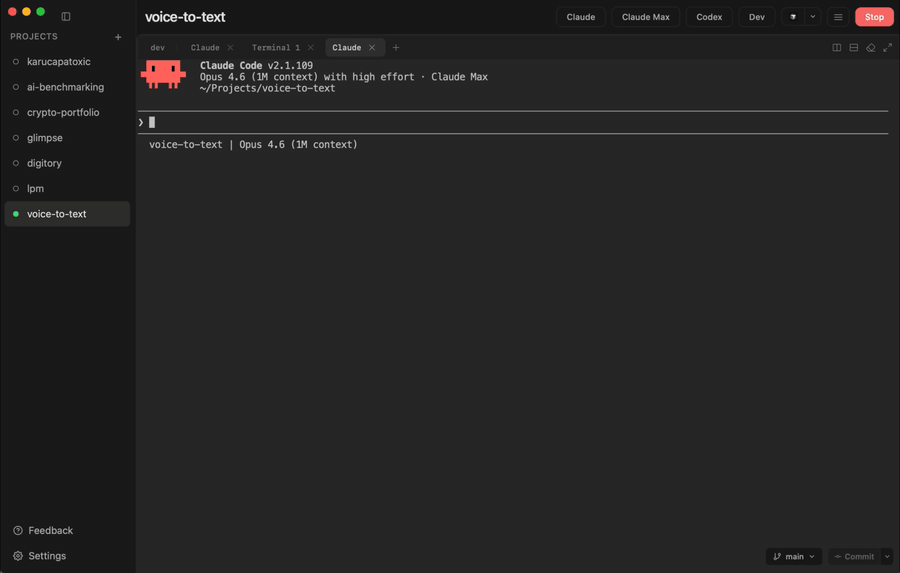

# VoiceToText — Free Offline Dictation App for macOS

**Free, open-source speech-to-text for Mac.** Hold a global hotkey, speak, release, and your words are typed into any app — Claude Code, Codex, Cursor, Slack, Notes, VS Code, Chrome, anywhere. Perfect for prompting AI coding agents by voice. 100% local, runs offline on the Apple Neural Engine. No subscriptions, no cloud, no data ever leaves your Mac.

A free alternative to Wispr Flow, Superwhisper, MacWhisper, and Apple Dictation.

## Features

- **Free and open source** — no paywall, no account, no telemetry
- **Offline and private** — audio is transcribed on-device, nothing is uploaded
- **Push-to-talk** — hold `⌥ Space` (customizable) to dictate into any focused app
- **Apple Silicon native** — accelerated by the Neural Engine on M1/M2/M3/M4/M5 Macs
- **Multiple models** — WhisperKit (OpenAI Whisper) and FluidAudio (Parakeet) engines, with quality/speed tradeoffs
- **Built for AI agents** — dictate prompts into Claude Code, Codex, Cursor, Copilot Chat, ChatGPT, and other LLM tools at natural speaking speed
- **Works everywhere** — Slack, Messages, Mail, browsers, code editors, terminals, any text field
- **Lightweight** — a native SwiftUI menu bar app, no Electron

## Download

[**Download VoiceToText**](https://github.com/gug007/voice-to-text/releases/latest/download/VoiceToText.dmg)

## Install

1. Open the DMG and drag **VoiceToText** to `/Applications`.
2. Launch it.
3. Grant Microphone and Accessibility permissions when prompted.
4. Hold `⌥ Space`, speak, release — your words are typed into the focused app.

## Requirements

- macOS 14 (Sonoma) or later
- Apple Silicon (M1 or newer) recommended

## Keywords

Free macOS dictation, offline speech-to-text Mac, voice-to-text Mac, Whisper Mac app, local speech recognition, push-to-talk dictation, Apple Neural Engine transcription, voice prompting for Claude Code, Codex CLI voice input, Cursor voice dictation, talk to AI coding agents, open-source Wispr Flow alternative, Superwhisper alternative, MacWhisper alternative.
