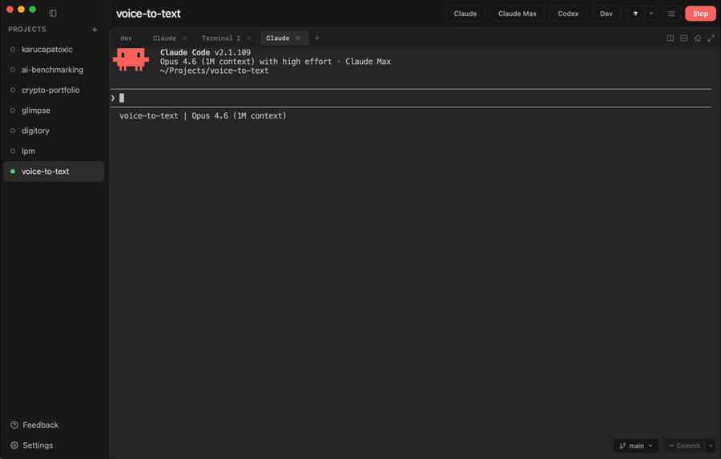

# VoiceToText — Free Offline Dictation App for macOS

**Free, open-source speech-to-text for Mac.** Use a global hotkey to record, then put the transcript into any app — Claude Code, Codex, Cursor, Slack, Notes, VS Code, Chrome, and more. Local transcription is the default and works offline after its speech model has been downloaded. Optional OpenAI and ElevenLabs engines are available when you explicitly select a cloud model and provide your own API key.

A free alternative to Wispr Flow, Superwhisper, MacWhisper, and Apple Dictation.

**Website:** [voicetotext.cc](https://voicetotext.cc)

## Features

- **Free and open source** — no app paywall, required VoiceToText account, or app telemetry
- **Local by default** — Parakeet runs on-device by default; local Whisper models are also available through WhisperKit
- **Offline after setup** — downloaded local models can transcribe without sending audio to a speech provider
- **Configurable recording shortcut** — press `⌥ Space` to toggle dictation, or switch to hold-to-record
- **Built for Apple Silicon** — local Core ML speech engines are optimized for M1 and newer Macs
- **Optional cloud models** — use OpenAI or ElevenLabs transcription with your own API key when you want a hosted or realtime engine
- **Meeting recording** — capture microphone and system audio together, transcribe when you stop, and save the recording and transcript to local History
- **Media import** — transcribe audio or video files that macOS can read
- **Optional speaker labels** — OpenAI's GPT-4o Transcribe Diarize can identify speaker turns; labels can be renamed in History
- **Built for AI agents** — dictate prompts into Claude Code, Codex, Cursor, Copilot Chat, ChatGPT, and other LLM tools at natural speaking speed
- **Works everywhere** — Slack, Messages, Mail, browsers, code editors, terminals, any text field
- **Lightweight** — a native SwiftUI menu bar app, no Electron

## Download

[**Download VoiceToText**](https://github.com/gug007/voice-to-text/releases/latest/download/VoiceToText.dmg)

## Install

1. Open the DMG and drag **VoiceToText** to `/Applications`.
2. Launch it.
3. Grant Microphone and Accessibility permissions when prompted.
4. Press `⌥ Space`, speak, then press it again — your words are typed into the focused app. You can switch the shortcut to hold-to-record in Settings.

The default local model downloads on first use. Meeting capture also needs Screen Recording permission so macOS will provide other participants' system audio; VoiceToText does not record the screen itself.

## Requirements

- macOS 15.0 or later
- Apple Silicon (M1 or newer); Intel Macs are not supported by current builds
- An internet connection for the initial local-model download, update checks, and any optional cloud features

## Local and cloud behavior

- With a local Parakeet or Whisper model selected, transcription runs on the Mac and the recorded audio is not uploaded to OpenAI, ElevenLabs, or a VoiceToText server.
- The app still uses the network to download local models and check GitHub Releases for updates.
- Selecting an OpenAI or ElevenLabs cloud model sends audio directly to that provider under the API key you supplied. Provider usage charges may apply.
- GPT-4o Transcribe Diarize is an OpenAI cloud model. Local models transcribe meetings but do not produce speaker labels.
- AI transcript actions such as cleanup, translation, or summarization send the transcript to OpenAI when you invoke them.
- Meeting recordings, imported media, transcripts, and speaker names are saved locally in VoiceToText History.

## Keywords

Free macOS dictation, offline speech-to-text Mac, voice-to-text Mac, Whisper Mac app, local speech recognition, push-to-talk dictation, Apple Neural Engine transcription, voice prompting for Claude Code, Codex CLI voice input, Cursor voice dictation, talk to AI coding agents, open-source Wispr Flow alternative, Superwhisper alternative, MacWhisper alternative.
